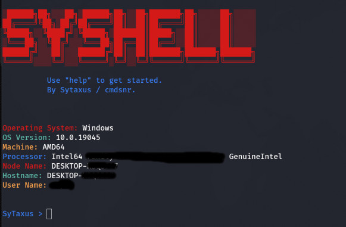
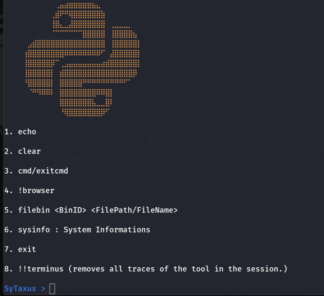

# SyShell
⚒️ A simple but fully working reverse shell with built-in commands made in Python. ⚒️


## About
SyShell is a reverse shell that offers pre-built commands while also offering complete control over the machine, specifically built for `Windows` systems (Executer). The listener (Syshell_listener.py) has been tested on both Windows and Linux, both work perfectly. 




## Commands
- `exit` : Exits.
- `getip`: Retrieves general location.
- `sysinfo` : Retrieves System informations.
- `filebin` :  Instead of DIRECTLY uploading from the windows machine to the host machine, we're using: https://filebin.net/ , which is an online free file upload server. Thanks to their API we are able to upload files by performing post requests. **Make sure you create a bin before using this command. Navigate to https://filebin.net/api ----> POST / Upload a file to a bin --> click "Try it out"** Then in the **bin** input, create your own custom ID, upload a test file, then  click **Execute**. Finally you can navigate to your bin by simply visiting `filebin.net/YOUR_BIN_ID` , and you now can upload files in the windows machine from your host machine using the following command:
```
filebin <YOUR BIN ID> <YOUR FILE NAME>
```
- `!browser` : Places Chrome saved passwords in a file `ShellNone_FileStandards_Chrome.txt`. 
- `cmd` : cmd offers the ability to execute cmd commands from host machine.
- `exitcmd` : To Exit cmd mode.
- `clear` : Clears The Screen.
- `!!terminus` : **Exits the session and deletes itself from the target machine.**
- `echo` : `echo <string>`
- `upload` : Currently unavailable / Doesn't work yet.



# Disclaimer
Use SyShell at your own risk. The author of SyShell does not take any responsibility for any damages or misuse caused by the software. SyShell is provided as-is, without any warranties. It is expected that users of SyShell will utilize (use) it responsibly and ethically, adhering to applicable laws and regulations. By using SyShell, you agree to accept all risks associated with its use. Always ensure that you have proper authorization before using SyShell on any system.
